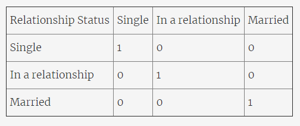
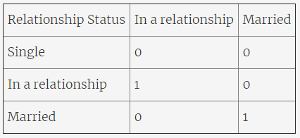
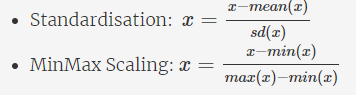
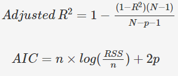

## Multiple Linear Regression

So far, we have discussed the simple linear regression, where the model is built using one independent variable only. But, what if you have multiple independent variables? How do you make a predictive model in such a case? Build a multiple linear regression on top of such a data is one such solution.

We will use the example of sales prediction using the TV marketing budget that you saw in the previous session to build a multiple linear regression model. But now, instead of just one variable, you will have three variables to deal with. The marketing budget will be split into three marketing channels — **TV marketing, radio marketing, and newspaper marketing**. You will see how adding more variables brings in many new problems and how do you approach them. In the end, you will learn about feature selection and feature elimination to build the most optimal model.

### Motivation: When One Variable isn't Enough

The term ‘multiple' in multiple linear regression gives you a fair idea in itself. It represents the relationship between two or more independent input variables and a response variable. Multiple linear regression is needed when one variable might not be sufficient to create a good model and make accurate predictions.

## Important Note

The R-squared will always either increase or remain the same when you add more variables. Because you already have the predictive power of the previous variable so the R-squared value can definitely not go down. And a new variable, no matter how insignificant it might be, cannot decrease the value of R-squared. It is recommended that you check the R-squared after adding these variables to see how much has the model improved.

## Formulation of MLR

Let’s now look at the formulation of multiple linear regression. Most of the concepts in multiple linear regression are quite similar to those in simple linear regression. The formulation for predicting the response variable now becomes:

### Interpretation of the cofficients:
Change in the mean response, E(y), per unit increase in the variable when the other predictors are held constant.

Apart from the formulation, there are some other aspects that still remain the same:

1. The model now fits a hyperplane instead of a line
2. Coefficients are still obtained by minimising the sum of squared errors, the least squares criteria
3. For inference, the assumptions from simple linear regression still hold - zero-mean, independent and normally distributed error terms with constant variance

## Moving from SLR to MLR: New Considerations

When moving from a simple linear regression model to a multiple linear regression model, there are a few things that you have to look at. Adding more isn't always helpful.

The new aspects to consider when moving from simple to multiple linear regression are:

### 1. Overfitting
* As you keep adding the variables, the model may become far too complex
* It may end up memorising the training data and will fail to generalise
* A model is generally said to overfit when the training accuracy is high while the test accuracy is very low

### 2. Multicollinearity
* Associations between predictor variables

Multicollinearity refers to the phenomenon of having related predictor variables in the input dataset. In simple terms, in a model which has been built using several independent variables, some of these variables might be interrelated, due to which the presence of that variable in the model is redundant. You drop some of these related independent variables as a way of dealing with multicollinearity.

Multicollinearity affects:

* **Interpretation:**
    * Does “change in Y, when all others are held constant” apply?
* **Inference:**
    * Coefficients swing wildly, signs can invert
    * p-values are, therefore, not reliable

**Multicollinearity does not affect:**
* the predictions, precision of predictions
* goodness-of-fit statistics

Multicollinearity is, thus, a big issue when you are trying to interpret the model. It is essential to detect and deal with the multicollinearity present in the model.

### 3. Feature selection
* Selecting the optimal set from a pool of given features, many of which might be redundant becomes an important task

## Detecting multicollinearity: correlations

Two basic ways of dealing with multicollinearity are:

1. Looking at pairwise correlations
    * Looking at the correlation between different pairs of independent variables (by plotting pair plots and checking correlation cofficient)

2. Checking the **Variance Inflation Factor (VIF)**
    * Sometimes pairwise correlations aren't enough
    * Instead of just one variable, the independent variable might depend upon a combination of other variables
    * VIF calculates how well one independent variable is explained by all the other independent variables combined, excluding the target variable

The VIF is given by:

where 'i' refers to the i-th variable which is being represented as a linear combination of rest of the independent variables. 

The common heuristic we follow for the VIF values is:
* **> 10:**  Definitely high VIF value and the variable should be eliminated.
* **> 5:**  Can be okay, but it is worth inspecting.
* **< 5:** Good VIF value. No need to eliminate this variable.

## Dealing with multicollinearity
Some methods that can be used to deal with multicollinearity are:

1. **Dropping variables**
* Drop the variable which is highly correlated with others
* Pick the business interpretable variable

2. **Create new variable** using the interactions of the older variables
* Add interaction features, i.e. features derived using some of the original features

3. **Variable transformations**
* Principal Component Analysis
* Partial Least Square (out of scope)

## Dealing with Categorical Variables

So far, you have worked with numerical variables. But many times, you will have non-numeric variables in the datasets. These variables are also known as categorical variables. Obviously, these variables can't be used directly in the model since they are non-numeric.

When you have a categorical variable with say 'n' levels, the idea of dummy variable creation is to build 'n-1' variables, indicating the levels. For a variable say, 'Relationship' with three levels namely, 'Single', 'In a relationship', and 'Married', you would create a dummy table like the following:

But you can clearly see that there is no need of defining three different levels. If you drop a level, say 'Single', you would still be able to explain the three levels.

Let's drop the dummy variable 'Single' from the columns and see what the table looks like:

If both the dummy variables namely 'In a relationship' and 'Married' are equal to zero, that means that the person is single. If 'In a relationship' is one and 'Married' is zero, that means that the person is in a relationship and finally, if 'In a relationship' is zero and 'Married' is 1, that means that the person is married. N-1 dummy variables can be used to describe a categorical variable with N levels.

## Feature Scaling
Why do we need to scale features?
1. Ease of interpretation.
If variables have very different scales then cofficent do not signifies importance of them. One good way is if we can have all of them on one scale, then it is very easy to compare the cofficients of one with other. So interpretation becomes very easy if we scale features in multiple linear regression.

2. Faster convergence for gradient descent methods.
As in the backend gradient descent happens. If we have a lot of features in very different scales, then it takes lot of time for convergence. If we can get them to same ranges i.e. -1 to 1 or 0 to 1 which are close by then convergence happens much faster. So feature scaling is recommended.

It is important to note that scaling just affects the coefficients and none of the other parameters like t-statistic, F-statistic, p-values, R-squared, etc.

There are two major methods to scale the variables, i.e. **standardisation and MinMax scaling**.

**Standardisation** basically brings all of the data into a standard normal distribution with mean zero and standard deviation one. **MinMax scaling**, on the other hand, brings all of the data in the range of 0 and 1. The formulae in the background used for each of these methods are as given below: 

## Model Assessment and Comparison

Once the model is built, you would want to assess it in terms of its predictive powers. For multiple linear regression, you may build more than one model, with different combinations of the independent variables. In such a case, you would also need to compare these models with one another to check which one yields optimal results. 

Now, for the assessment, you have a lot of new considerations to make. Besides, selecting the best model to obtain decent predictions becomes quite subjective. You need to maintain a balance between **keeping the model simple** and **explaining the highest variance** (which means that you would want to keep as many variables as possible). This can be done using the key idea that a model can be penalised for keeping a large number of predictor variables.

Hence, there are two new parameters that come into picture:

Here, **n or N** is the sample size meaning the number of rows you'd have in the dataset and **p** is the number of predictor variables. AIC is akaike information criterion, low value of AIC is better.

## R-squared vs Adjusted R-squared
The major difference between R-squared and Adjusted R-squared is that R-squared doesn't penalise the model for having more number of variables. Thus, if you keep on adding variables to the model, the R-squared will always increase (or remain the same in the case when the value of correlation between that variable and the dependent variable is zero). Thus, R-squared assumes that any variable added to the model will increase the predictive power.

Adjusted R-squared on the other hand, penalises models based on the number of variables present in it. So if you add a variable and the Adjusted R-squared drops, you can be certain that that variable is insignificant to the model and shouldn't be used. So in the case of multiple linear regression, you should always look at the adjusted R-squared value in order to keep redundant variables out from your regression model.

## Feature Selection
The one crucial aspect of multiple linear regression that remains to be discussed is feature selection. When building a multiple linear regression model, you might have quite a few potential predictor variables; selecting just the right ones becomes an extremely important exercise.

To get the optimal model, you can always try all the possible combinations of independent variables and see which model fits the best (2^p models for p features). But this method is obviously, time-consuming and infeasible. Hence, you need some other method to get a decent model. 

This is where **manual feature elimination** comes in, where you:
* Build the model with all the features
* Drop the features that are least helpful in prediction (high p-value means that the variable is not significant, and hence, doesn't help much in prediction.)
* Drop the features that are redundant (using correlations and VIF)
* Rebuild model and repeat

**Automated approach**
But what rules/criteria do we use?
- **Top 'n' features:** RFE (Recursive Feature Elimination)
Recursive feature elimination is based on the idea of repeatedly constructing a model (for example, an SVM or a regression model) and choosing either the best or worst performing feature (for example, based on coefficients), setting the feature aside and then repeating the process with the rest of the features. This process is applied until all the features in the dataset are exhausted. Features are then ranked according to when they were eliminated. As such, it is a greedy optimisation for finding the best performing subset of features.
https://scikit-learn.org/stable/modules/generated/sklearn.feature_selection.RFE.html
- **Forward / Backward / Stepwise selection:** based on AIC 
- **Regularization:** (Lasso)

A balanced approach: use a **combination** of automated (coarse tuning) + manual (fine tuning) selection.You need to combine the manual and the automated approaches in order to get an optimal model relevant to the business. Hence, you first do an automated elimination (coarse tuning), and when you have a small set of potential variables left to work with, you can use your expertise and subjectivity to eliminate a few other features (fine tuning).