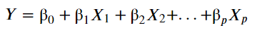
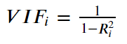

# Multiple Linear Regression

So far, we have discussed the simple linear regression, where the model is built using one independent variable only. But, what if you have multiple independent variables? How do you make a predictive model in such a case? Build a multiple linear regression on top of such a data is one such solution.

We will use the example of sales prediction using the TV marketing budget that you saw in the previous session to build a multiple linear regression model. But now, instead of just one variable, you will have three variables to deal with. The marketing budget will be split into three marketing channels — **TV marketing, radio marketing, and newspaper marketing**. You will see how adding more variables brings in many new problems and how do you approach them. In the end, you will learn about feature selection and feature elimination to build the most optimal model.

# Motivation: When One Variable isn't Enough

The term ‘multiple' in multiple linear regression gives you a fair idea in itself. It represents the relationship between two or more independent input variables and a response variable. Multiple linear regression is needed when one variable might not be sufficient to create a good model and make accurate predictions.

## Important Note

The R-squared will always either increase or remain the same when you add more variables. Because you already have the predictive power of the previous variable so the R-squared value can definitely not go down. And a new variable, no matter how insignificant it might be, cannot decrease the value of R-squared. It is recommended that you check the R-squared after adding these variables to see how much has the model improved.

# Formulation of MLR

Let’s now look at the formulation of multiple linear regression. Most of the concepts in multiple linear regression are quite similar to those in simple linear regression. The formulation for predicting the response variable now becomes:

### Interpretation of the cofficients:
Change in the mean response, E(y), per unit increase in the variable when the other predictors are held constant.

Apart from the formulation, there are some other aspects that still remain the same:

1. The model now fits a hyperplane instead of a line
2. Coefficients are still obtained by minimising the sum of squared errors, the least squares criteria
3. For inference, the assumptions from simple linear regression still hold - zero-mean, independent and normally distributed error terms with constant variance

# Moving from SLR to MLR: New Considerations

When moving from a simple linear regression model to a multiple linear regression model, there are a few things that you have to look at. Adding more isn't always helpful.

The new aspects to consider when moving from simple to multiple linear regression are:

### 1. Overfitting
* As you keep adding the variables, the model may become far too complex
* It may end up memorising the training data and will fail to generalise
* A model is generally said to overfit when the training accuracy is high while the test accuracy is very low

### 2. Multicollinearity
* Associations between predictor variables

Multicollinearity refers to the phenomenon of having related predictor variables in the input dataset. In simple terms, in a model which has been built using several independent variables, some of these variables might be interrelated, due to which the presence of that variable in the model is redundant. You drop some of these related independent variables as a way of dealing with multicollinearity.

Multicollinearity affects:

* **Interpretation:**
    * Does “change in Y, when all others are held constant” apply?
* **Inference:**
    * Coefficients swing wildly, signs can invert
    * p-values are, therefore, not reliable

**Multicollinearity does not affect:**
* the predictions, precision of predictions
* goodness-of-fit statistics

Multicollinearity is, thus, a big issue when you are trying to interpret the model. It is essential to detect and deal with the multicollinearity present in the model.

### 3. Feature selection
* Selecting the optimal set from a pool of given features, many of which might be redundant becomes an important task

# Detecting multicollinearity: correlations

Two basic ways of dealing with multicollinearity are:

1. Looking at pairwise correlations
    * Looking at the correlation between different pairs of independent variables (by plotting pair plots and checking correlation cofficient)

2. Checking the **Variance Inflation Factor (VIF)**
    * Sometimes pairwise correlations aren't enough
    * Instead of just one variable, the independent variable might depend upon a combination of other variables
    * VIF calculates how well one independent variable is explained by all the other independent variables combined, excluding the target variable

The VIF is given by:

where 'i' refers to the i-th variable which is being represented as a linear combination of rest of the independent variables. 

The common heuristic we follow for the VIF values is:
* **> 10:**  Definitely high VIF value and the variable should be eliminated.
* **> 5:**  Can be okay, but it is worth inspecting.
* **< 5:** Good VIF value. No need to eliminate this variable.

# Dealing with multicollinearity
Some methods that can be used to deal with multicollinearity are:

1. **Dropping variables**
* Drop the variable which is highly correlated with others
* Pick the business interpretable variable

2. **Create new variable** using the interactions of the older variables
* Add interaction features, i.e. features derived using some of the original features

3. **Variable transformations**
* Principal Component Analysis
* Partial Least Square (out of scope)

